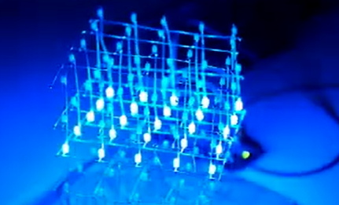

# LightEffects
LEDCUBEのアニメーションを作成できるUnity製GUIツール  
BOOTH & Reference : https://booth.pm/ja/items/4796978
チーム内でこのツールが必要になり、個人で開発

# LEDCUBE
LEDでアニメーションパターンを発行するハードウェア  
電気回路設計を一部手伝う

# Version

Unity : 2021.3.27f1
